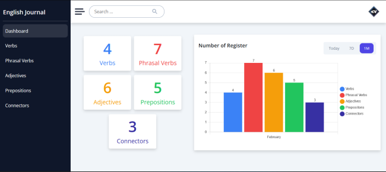

<!-- Please update value in the {}  -->

<h1 align="center">English Journal App</h1>

<div align="center">

[](https://app.netlify.com/sites/englishjournal/deploys)
</div>


<!-- TABLE OF CONTENTS -->

## Table of Contents

- [Overview](#overview)
- [Built With](#built-with)
- [Resources](#resources)

<!-- OVERVIEW -->

## Overview



This app was built with the purpose to solve the following problem I am learning English by myself and I needed to save my progress at the beginning I started to save my notes in a notebook, but I thought why not build an app where I can be able to save my English progress and I created English Journal is a web app where you can save verbs, phrasal verbs, adjectives, connectors and prepositions. I built this app using MEAN stack.

### What you can do with English Journal?
  - You can save, update, and delete your verbs, phrasal verbs, adjectives, connectors and prepositions.
  - You can create reports.
  - You can filter by verbs, phrasal verbs, adjectives, connectors and prepositions.
  - You can search by verbs, phrasal verbs, adjectives, connectors and prepositions.


### What did I learn building this app?
I learned a lot of things developing this app, for instance I learned how to use interceptors in angular and their different  cases of use, I learned how to use chart.js with angular. Short, long story, I learn so much creating this project.


## Built With

<!-- This section should list any major frameworks that you built your project using. Here are a few examples.-->

### Frontend

  - Angular
  - SCSS
  - Typescript
  - Bootstrap
  - SweetAlert
  - Chart.js
  - BEM (block__element--modifier)
  - Mobile-first workflow

### Backend
  - Express.js
  - Mongoose
  - Mongo DB

You can check the API right here


## Resources
These are some resources that I used to develop the app.

<!-- This section should list any articles or add-ons/plugins that helps you to complete the project. This is optional but it will help you in the future. For example: -->

- [Sweetalert2](https://sweetalert2.github.io/)
- [Angular Reactive Forms Tips and Tricks](https://netbasal.com/angular-reactive-forms-tips-and-tricks-bb0c85400b58)
- [Exploring the HttpClientModule in Angular](https://indepth.dev/posts/1142/exploring-the-httpclientmodule-in-angular)
- [ng2-charts](https://valor-software.com/ng2-charts/)


## How To Use

<!-- Example: -->

To clone and run this application, you'll need [Git](https://git-scm.com) and [Node.js](https://nodejs.org/en/download/) (which comes with [npm](http://npmjs.com)) installed on your computer. From your command line:

```bash
# Clone this repository
$ git clone hhttps://github.com/VladimirValdes/EnglishJournalApp

# Install dependencies
$ npm install

# Run the app
$ ng serve
```


<!-- ## Contact

- Website [your-website.com](https://{your-web-site-link})
- GitHub [@your-username](https://{github.com/your-usermame})
- Twitter [@your-twitter](https://{twitter.com/your-username}) -->
